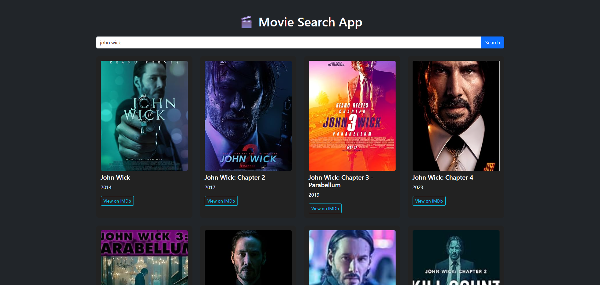

🎬 Movie Search App

A simple  Movie Search Application built using **HTML**, **CSS**, and **JavaScript (ES6+)**.  
It allows users to search for any movie and view its title, year, poster, and a direct IMDb link — using the OMDb API.

 <!-- Replace with your actual screenshot file name -->

---

🚀 Features

- 🔍 Search for any movie by title  
- 🎥 Displays title, release year, and poster  
- 🖼️ Placeholder image for missing posters  
- 🌐 Direct link to IMDb movie page  
- ✅ Error handling for invalid or empty searches  
- 📱 Responsive layout using Bootstrap 5

---

🛠️ Technologies Used

- HTML5
- CSS3 + Bootstrap 5
- JavaScript (ES6+)
- OMDb API (http://www.omdbapi.com/)
- Fetch API (with `async`/`await`)

---

⭐ ES6 Features Used

- `const` and `let`
- Arrow Functions (`=>`)
- Template Literals (`` `Hello ${name}` ``)
- Async/Await (`async` / `await`)
- DOM Manipulation

---

📦 How to Use

1. **Clone or Download** this repository  
2. Get a **free API key** from [OMDb API](https://www.omdbapi.com/apikey.aspx)  
3. Open `main.js` and replace the placeholder with your own API key:

   ```js
   const api_key = "YOUR_OMDB_API_KEY";
