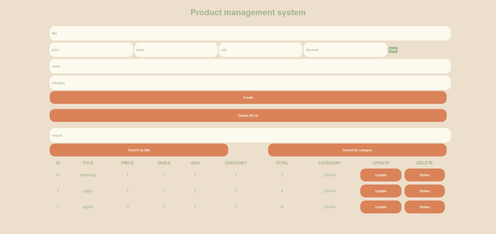

# Product Management System

A simple CRUD (Create, Read, Update, Delete) application built with vanilla JavaScript that manages products with local storage persistence.

## Features

- **Create products** with:
  - Title
  - Price, Taxes, Ads, Discount (with automatic total calculation)
  - Category
  - Quantity (count)
  
- **Read/View products** in a clean table format
- **Update existing products**
- **Delete products** (single or all at once)
- **Search functionality** by:
  - Product title
  - Product category
- **Data persistence** using browser's localStorage

## Technologies Used

- HTML5
- CSS
- Vanilla JavaScript

## What I Applied From JS

- DOM manipulation without libraries
- localStorage API for data persistence
- CRUD operations implementation
- Event handling in JavaScript
- Basic form validation
- Dynamic HTML generation
- Search/filter functionality

## How to Run

1. Clone the repository
2. Open `crud.html` in any modern web browser
3. No server required - works directly from file system
